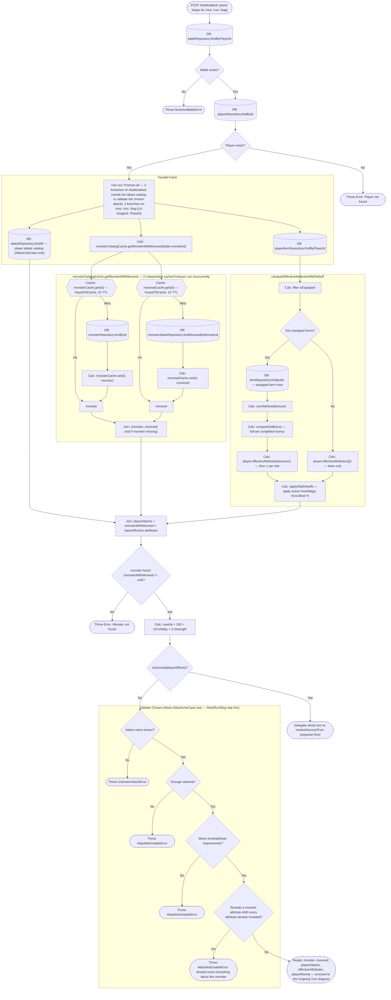

# Battle System — Full Flow (`apps/api` only)

Everything the API does for battle-related requests — from loading state to
returning the response. UI/`apps/web` is out of scope. Split into three
diagrams, traced directly from source:

1. **Setup** — the shared pre-turn loading/validation phase
   (`AttackUseCase.execute()`'s opening steps; `RestUseCase`,
   `RunFromBattleUseCase`, and `UseBagItemUseCase` do the same thing minus
   one branch — see the `PFan`/`PARALLEL` node below, the player attack
   catalog fetch is Attack-only since Phase5 dropped it from the other
   three, which never needed it).
2. **Battle Start — First Turn & Ambush** — `StartBattleUseCase.execute()`
   (`POST /battle/start`): cooldown/empty-encounter checks, picking a
   monster, and the ambush roll that can hit (or even kill) the player
   before they've acted at all.
3. **Ongoing Turn** — the recurring `POST /battle/attack` cycle once a
   `Battle` row exists: the player's strike, `resolveMonsterTurn`'s reply,
   effect ticks, and `settleTurn`'s persistence + final response.

Shapes:

- `[( )]` cylinder — a real DB round-trip.
- `{{ }}` hexagon — a **cached** lookup (in-memory after the first DB read,
  no round-trip on a cache hit).
- `[ ]` rectangle — a pure in-process calculation, no I/O.
- `{ }` diamond — a branch.
- `([ ])` stadium — a terminal outcome (thrown error or returned report).

## 1. Setup — Pre-Turn Loading & Validation

## 2. Battle Start — First Turn & Ambush (`POST /battle/start`)

```mermaid
flowchart TD
    SBStart(["POST /battle/start"]) --> SB1
    SB1[("DB: battleRepository.findByPlayerId")] --> SB1C{"Existing battle already in progress?"}
    SB1C -- Yes --> ErrExisting(["Throw BattleAlreadyInProgressError"])
    SB1C -- No --> SB2[("DB: playerRepository.findById")]
    SB2 --> SB2C{"Player exists?"}
    SB2C -- No --> ErrPlayer(["Throw Error: Player not found"])
    SB2C -- Yes --> LootCheck{"Unclaimed pendingLoot from a prior kill?"}

    LootCheck -- Yes --> ClearLoot[("DB: playerRepository.update — clear pendingLoot")]
    ClearLoot --> CooldownCheck
    LootCheck -- No --> CooldownCheck

    CooldownCheck{"lastRunAt set AND still inside the run cooldown (30s, 15s VIP)?"}
    CooldownCheck -- Yes --> ErrCooldown(["Throw RunCooldownError"])
    CooldownCheck -- No --> SB3

    subgraph SBPREP["Attacks + Effective Attributes"]
        SB3[("DB: attackRepository.findAll — player attack catalog")] --> SB4["Calc: computeEffectiveAttributes — equip lookup, no debuffs yet (same shape as Setup diagram's computeEffectiveAttributesWithDebuff)"]
        SB4 --> SB5["Calc: build availableAttacks (meetsRequirements per attack)"]
    end

    SB5 --> EmptyRoll{"roll 1-100 <= emptyEncounterChance (20%)?"}
    EmptyRoll -- Yes --> EmptyOut(["Return StartBattleOutput — monster: null, outcome: null"])
    EmptyRoll -- No --> SB6[("DB: monsterRepository.findAllByRegion(input.region)")]
    SB6 --> RegionCheck{"Any monsters in this region?"}
    RegionCheck -- No --> EmptyOut2(["Return StartBattleOutput — monster: null, outcome: null"])
    RegionCheck -- Yes --> PickMonster["Calc: pick a random monster from the region's list"]

    PickMonster --> MovesetCache{{"Cache: monsterCatalogCache.getMoveset(monster.id) — KeyedTtlCache, 1h TTL (DB: monsterAttackRepository.findMovesetByMonsterId on miss)"}}

    MovesetCache --> AmbushRoll{"roll 1-100 <= monster.ambushChance?"}
    AmbushRoll -- No --> CreateBattle
    AmbushRoll -- Yes --> PickAmbushAttack["Calc: pick a random non-special moveset attack (or HIT fallback)"]
    PickAmbushAttack --> AmbushHitRoll["Calc: rollHit — monsterDex/playerAgi/monsterLuck"]
    AmbushHitRoll --> AmbushHitCheck{"Hit?"}
    AmbushHitCheck -- No --> AmbushDeathCheck
    AmbushHitCheck -- Yes --> AmbushDmg["Calc: computeDamage — normal roll-based formula"]
    AmbushDmg --> AmbushApply["Calc: playerCurrentHp = max(0, hp − damage)"]
    AmbushApply --> AmbushProc["Calc: rollEffectProc — Luck diff, roll 5-100"]
    AmbushProc --> AmbushProcCheck{"Proced?"}
    AmbushProcCheck -- Yes --> AmbushCounter{{"Cache: effectCounterRepository.findByKind (in-memory Map)"}}
    AmbushCounter --> AmbushAddEffect["Calc: addBattleEffect on player — stack/refresh"]
    AmbushAddEffect --> AmbushDeathCheck
    AmbushProcCheck -- No --> AmbushDeathCheck

    AmbushDeathCheck{"playerCurrentHp <= 0 from the ambush?"}
    AmbushDeathCheck -- Yes --> DeathLevels[("DB: levelRepository.findAll")]
    DeathLevels --> DeathPenalty["Calc: applyDeathPenalty — floor(-1% xp), possible de-level"]
    DeathPenalty --> DeathUpdate[("DB: playerRepository.update — xp, level, lastDeathAt")]
    DeathUpdate --> DeathOut(["Return StartBattleOutput — outcome: lost, monster: null, no Battle row created"])
    AmbushDeathCheck -- No --> CreateBattle

    CreateBattle["Calc: build new Battle — round 1, playerCurrentHp/Stamina, monster hp/stamina"] --> SB7[("DB: battleRepository.create")]
    SB7 --> StartOut(["Return StartBattleOutput — outcome: ongoing, ambushOccurred flag, monster + messages"])
```

## 3. Ongoing Turn — Player Turn, Monster Turn, Resolution (`POST /battle/attack`)

```mermaid
flowchart TD
    Entry(["From the Setup diagram: attack validated — monster, moveset, playerAttacks, effectiveAttributes, playerMaxHp ready"]) --> PH

    subgraph PLAYERATK["PLAYER TURN · Player's Strike"]
        PH["Calc: rollHit — playerDex/monsterAgi/playerLuck, roll 10-100"] --> HC{"Hit?"}
        HC -- No --> PMiss["playerDamage = 0"]
        HC -- Yes --> Dmg["Calc: computeDamage — defense scales on the incoming attack's own attribute (no defensive 'stance' concept anymore, combat-balance follow-up), ceil(mult×atk)+staminaCost−ceil(defense), floor 1"]
        Dmg --> ApplyDmg["Calc: monsterCurrentHp = max(0, hp − playerDamage)"]
        ApplyDmg --> EffCheck{"Attack applies an effect?"}
        EffCheck -- Yes --> Proc["Calc: rollEffectProc — Luck diff, roll 5-100"]
        Proc --> ProcCheck{"Proced?"}
        ProcCheck -- Yes --> Counter1{{"Cache: effectCounterRepository.findByKind — cure item (in-memory Map, 24h TTL)"}}
        Counter1 --> AddEff1["Calc: addBattleEffect on monster — stack/refresh"]
        EffCheck -- No --> RevCheck
        ProcCheck -- No --> RevCheck
        AddEff1 --> RevCheck
        RevCheck{"REVEAL SPELL used?"} -- Yes --> PickRevCount["Calc: rollRevealCount — Intelligence-scaled roll: Int≥100 up to 3, Int≥50 up to 2, else 1"]
        PickRevCount --> PickRev["Calc: pickUnrevealedAttributes — RNG picks up to count distinct unrevealed keys"]
        RevCheck -- No --> AliveCheck
        PickRev --> AliveCheck
        PMiss --> AliveCheck
    end

    AliveCheck{"monsterCurrentHp > 0?"}
    AliveCheck -- No, monster died --> TickEffects
    AliveCheck -- Yes --> MT0

    subgraph MONSTERTURN["MONSTER TURN · resolveMonsterTurn"]
        MT0{"Currently charging a special?"}
        MT0 -- Yes --> DecCh["Calc: chargeRoundsLeft -= 1"]
        DecCh --> StillCh{"Still charging?"}
        StillCh -- Yes --> Rest1["Calc: regen at Rest rate (15), push charge-warning message"]
        StillCh -- No, unleash --> SDmg["Calc: computeDamage — guaranteed hit, no roll"]
        SDmg --> ApplyS["Calc: playerCurrentHp -= dmg; stamina -= cost"]
        ApplyS --> InCounter{{"Cache: effectCounterRepository.findByKind — innate effect (in-memory Map)"}}
        InCounter --> AddIn["Calc: addBattleEffect — innate DoT, guaranteed 100%"]
        AddIn --> ExtraCheck{"Special carries an extra distinct effect?"}
        ExtraCheck -- Yes --> ExCounter{{"Cache: effectCounterRepository.findByKind — extra effect (in-memory Map)"}}
        ExCounter --> AddEx["Calc: addBattleEffect + start shared status cooldown if Stun/Fear/Magic Aura Blast"]
        ExtraCheck -- No --> SRegen
        AddEx --> SRegen

        MT0 -- No --> Aff["Calc: filter moveset — affordable AND not on status cooldown"]
        Aff --> SpecAvail{"Any special affordable?"}
        SpecAvail -- Yes --> StartCh["Calc: pick special (random tie-break), start charging — also regens at Rest rate (15) and pushes a charge-warning message, same as Rest1"]
        StartCh --> SRegen
        SpecAvail -- No --> NormAvail{"Any normal attack affordable?"}
        NormAvail -- No --> Rest2["Calc: regen at Rest rate (15)"]
        Rest2 --> SRegen
        NormAvail -- Yes --> Score["Calc: computeDamage for every affordable normal candidate"]
        Score --> Select["Calc: selectByWeightedDamage — max(damage+weight), ties by moveset order"]
        Select --> MHit["Calc: rollHit — monsterDex/playerAgi/monsterLuck"]
        MHit --> MHitCheck{"Hit?"}
        MHitCheck -- Yes --> ApplyM["Calc: playerCurrentHp -= damage; stamina -= cost"]
        ApplyM --> MProc["Calc: rollEffectProc"]
        MProc --> MProcCheck{"Proced?"}
        MProcCheck -- Yes --> MCounter{{"Cache: effectCounterRepository.findByKind (in-memory Map)"}}
        MCounter --> AddM["Calc: addBattleEffect on player"]
        AddM --> SRegen
        MProcCheck -- No --> SRegen
        MHitCheck -- No --> DeductOnly["Calc: stamina -= cost only"]
        DeductOnly --> SRegen
        Rest1 --> SRegen

        SRegen["Calc: monsterCurrentStamina regen, capped at monster.maxStamina"] --> WBump["Calc: bumpAttackWeights — +monster.level to unpicked, reset picked to 0"]
        WBump --> CDTick["Calc: statusCooldownRoundsLeft = max(0, −1)"]
    end

    CDTick --> TickEffects

    subgraph TICK["RESOLUTION · End-of-Turn Effect Ticks"]
        TickEffects["Calc: tickEffects(playerEffects) — DoT dmg, debuff/stun advance, expire"] --> TickM["Calc: tickEffects(monsterEffects)"]
        TickM --> ApplyTicks["Calc: both HPs -= totalDamage, floor 0"]
        ApplyTicks --> PRegen["Calc: playerCurrentStamina += passive regen (5), capped at maxStamina(level)"]
    end

    PRegen --> ST1

    subgraph SETTLE["RESOLUTION · settleTurn — Persist + Build Response"]
        ST1["Calc: applyStatDebuffs (for display) + build effect/attribute views"] --> DeadM{"monsterCurrentHp <= 0?"}

        DeadM -- "Yes: WON" --> LL1[("DB: levelRepository.findAll")]
        LL1 --> XpCalc["Calc: applyXpGain — new xp/level/attributePoints"]
        XpCalc --> RD1["Calc: rollDropPool(drops)"]
        RD1 --> RD2["Calc: rollDropPool(exclusiveDrops)"]
        RD2 --> RD3["Calc: rollDropPool(legendaryDrops)"]
        RD3 --> LegWin{"Legendary roll won?"}
        LegWin -- Yes --> ItemLU[("DB: itemRepository.findById — check rarity")]
        ItemLU --> UniqCheck{"Rarity = unique?"}
        UniqCheck -- Yes --> Claim[("DB: uniqueItemOwnershipRepository.tryClaim — atomic")]
        Claim --> Combine
        UniqCheck -- No --> Combine
        LegWin -- No --> Combine
        Combine["Calc: combine drop/exclusive/legendary into lootOffer"] --> BossKillCheck{"battle.dungeonIsBossFight? (Battle entity, any tier — distinct from the tier-3-only check below)"}
        BossKillCheck -- Yes --> UpdWin[("DB: playerRepository.update — xp, level, attributePoints, pendingLoot, AND reset Player.dungeonRunTier/Step/TotalSteps to null (the run ends outright, any tier's boss)")]
        BossKillCheck -- No --> UpdWinPlain[("DB: playerRepository.update — xp, level, attributePoints, pendingLoot")]
        UpdWin --> DunCheck{"battle.dungeonTier==3 AND dungeonIsBossFight?"}
        UpdWinPlain --> DunCheck
        DunCheck -- Yes --> IncKill[("DB: dungeonSlayerRankingRepository.incrementKill — Dungeon Slayer leaderboard, tier-3 boss kills only")]
        DunCheck -- No --> DelWin
        IncKill --> DelWin[("DB: battleRepository.deleteByPlayerId")]
        DelWin --> Won(["Return TurnReport — outcome: won, dungeonRunEnded: battle.dungeonIsBossFight"])

        DeadM -- No --> DeadP{"playerCurrentHp <= 0?"}
        DeadP -- "Yes: LOST" --> LL2[("DB: levelRepository.findAll")]
        LL2 --> DeathPen["Calc: applyDeathPenalty — floor(-1% xp), possible de-level"]
        DeathPen --> UpdDeath[("DB: playerRepository.update — xp, level, lastDeathAt")]
        UpdDeath --> DelLoss[("DB: battleRepository.deleteByPlayerId")]
        DelLoss --> Lost(["Return TurnReport — outcome: lost, dungeonRunEnded: false"])

        DeadP -- "No: ONGOING" --> BuildB["Calc: build updated Battle — round+1, new state fields"]
        BuildB --> UpdBattle[("DB: battleRepository.update")]
        UpdBattle --> Ongoing(["Return TurnReport — outcome: ongoing, dungeonRunEnded: false"])
    end
```

## Notes

- **Player Turn** and **Monster Turn** are mutually dependent on the same
  turn's state — the monster only replies at all if `AliveCheck` finds it
  survived the player's strike (`monsterCurrentHp > 0`); otherwise the turn
  skips straight to `TICK`/`SETTLE` with `monsterAttack: null` in the report.
- **`monsterCatalogCache`** (monster + moveset) is a `KeyedTtlCache` per
  `monster.id`, 1h TTL — two independent per-id caches (one for the
  `Monster` row, one for its moveset) behind one class, so a caller that
  only needs one of them isn't forced to fetch/cache the other:
  `getMonsterWithMoveset` (Setup diagram, used by Attack/Rest/Run/Bag) fetches
  both concurrently; `getMoveset` alone (Battle Start diagram, and the
  dungeon flows' `beginDungeonFight`) is used wherever the monster is
  already in hand. On a cache hit, both DB reads it used to cost are gone
  entirely — with many concurrent players fighting a small rotating set of
  catalog monsters, most turns hit this cache warm.
- **`effectCounterRepository.findByKind`** is no longer a DB call in the
  steady state either — `PostgresEffectCounterRepository` loads the whole
  6-row `effect` table once and serves every lookup from an in-memory `Map`
  behind a 24h `TtlCache`. It can still be called up to 3× in one turn
  (player's proc, plus either the monster's innate+extra unleash effects or
  its normal-attack proc, and once more on an ambush in the Battle Start
  diagram) — all now `Map.get` calls, not round-trips.
- **Still uncached**: `attackRepository.findAll()` (the player attack
  catalog — **Attack turns only** since Phase5 dropped this call from
  Rest/Run/Bag entirely, see the Setup diagram's `PFan` node) and
  `levelRepository.findAll()` (the XP curve, read on every kill/death
  regardless of action) are both just as static as the two caches above —
  flagged as the next candidates, not yet implemented.
- **Every DB call still made per turn on a warm cache** (common ongoing-turn
  path, **Attack specifically** — Rest/Run/Bag skip `attackRepository.findAll`):
  `battleRepository.findByPlayerId`, `playerRepository.findById`,
  `attackRepository.findAll`, `playerItemRepository.findByPlayerId`, and
  `itemRepository.findByIds` (only if the player has equipped items) — the
  monster/moveset pair costs 0 round-trips on a hit, 2 (run concurrently) on
  a miss. A kill adds `levelRepository.findAll`, `playerRepository.update`,
  `battleRepository.deleteByPlayerId`, plus conditionally
  `itemRepository.findById` + `uniqueItemOwnershipRepository.tryClaim`
  (legendary roll) and `dungeonSlayerRankingRepository.incrementKill`
  (Tier-3 boss kill).
- **Two independent "boss kill" conditions, easy to conflate**:
  `BossKillCheck` (`battle.dungeonIsBossFight`, any tier) resets the
  **Player** entity's `dungeonRunTier`/`dungeonRunStep`/`dungeonRunTotalSteps`
  to null — this is what actually ends a dungeon run, on any tier's boss.
  `DunCheck` (`battle.dungeonTier==3 AND dungeonIsBossFight`) is a
  *narrower*, separate condition that only gates
  `dungeonSlayerRankingRepository.incrementKill` — the Dungeon Slayer
  leaderboard only counts a Tier-3 boss kill, never Tier 1/2. Both read
  `Battle` entity fields; only `BossKillCheck`'s effect touches `Player`.
  The turn report's `dungeonRunEnded` field mirrors `BossKillCheck`'s
  result, not `DunCheck`'s — it's what `apps/web`'s loot screen uses to
  decide whether to offer Continue at all (bug fix, 2026-07-20: it
  previously re-derived this from `player.dungeonRun`, which is already
  null by the time that same kill's profile refresh lands — indistinguishable
  from "never was in a dungeon," so Continue stayed offered after a boss
  kill and silently started an unrelated wild battle instead of doing
  nothing useful).
- The **Dungeon variant** of a turn (`beginDungeonFight` /
  `ContinueDungeonUseCase`) reuses this exact same
  `resolveMonsterTurn`/`settleTurn` machinery once a fight is underway, and
  its own monster/moveset lookup goes through the same
  `monsterCatalogCache.getMoveset` as Battle Start — the only
  dungeon-specific differences are further upstream (tier scaling, daily
  attempts, Growl) and are covered in the root
  [README.md](../README.md#dungeons) instead.
